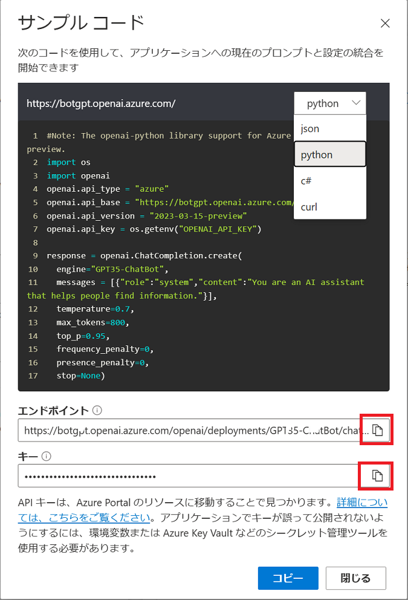
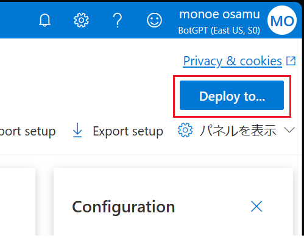

# 演習 1 ) Azure Open AI リソースとチャットボットの作成

Azure OpenAI Service では、OpenAI の強力な言語モデルを REST API として使用でき、開発者は、REST API、Python SDK、または Azure OpenAI Studio の Web ベースのインターフェイスを介してサービスにアクセスできます。

Azure Open AI Service については以下のドキュメントをご参照ください。

- [**Azure OpenAI Service とは**](https://learn.microsoft.com/ja-jp/azure/cognitive-services/openai/overview)

Azure OpenAI Service が提供する言語サービスは、GPT-3、GPT-4、ChatGPT (gpt-35-turbo)、Codex、Embeddings モデル シリーズなどがありますが、この演習では ChatGPT (gpt-35-turbo) を使用します。

 

## タスク 1 : Azure ポータルから Open AI リソースを作成する

Azure の提供する Open AI サービスを利用するために Open AI リソースを作成します。

この手順では Azure ポータルを使用してリソースを作成しますが、Azure CLI や Azure PowerShell を使用して作成することも可能です。

具体的な手順は以下のとおりです。

\[**手順**\]

1. Azure ポータルにサインインします

    [https://portal.azure.com](https://portal.azure.com)

2. ポータル画面上部の \[**+**\] リソースの作成 アイコンか、表示されていない場合は画面左上のハンバーガーメニューをクリックし、\[**リソースの作成**\] をクリックします。

    

3. 遷移した画面の検索ボックスに **OepnAI** と入力してキーボードの \[Enter\]キーを押下します

    検索結果の画面で、\[**Azure サービスのみ**\] チェックボックス にチェックを入れると **Azure OpenAI** のタイルが表示されるのでクリックします

    

4. Azure OpenAI のプランの選択画面に遷移するので、既定のまま \[**作成**\] ボタンをクリックします

5. Azure OpenAI の作成の \[**基本**\] 画面が表示されるので、各項目を以下のように入力します

    |  項目  |  値  |
    | ---- | ---- |
    |  **サブスクリプション \***  |  使用するサブスクリプションを選択  |
    |  **リソース グループ \***  |  既存のものを選択するか、「新規作成」リンクをクリックして作成  |
    |  **リージョン** | 任意のリージョン |
    |  **名前 \*** | 任意の名前 |
    |  **価格レベル \*** | **Standard S0** |

    

    もし、価格レベルが **Standard S0** が選択できない場合は、サブスクリプションの制限により、Azure OpenAI の利用が制限されています。その場合は、Azure サポートに問い合わせてください。

    

    入力が完了したら、\[**次へ**\] ボタンをクリックします

6. Azure OpenAI の作成の \[**ネットワーク**\] 画面に遷移するので、既定のまま \[**次へ**\] ボタンをクリックします

7. Azure OpenAI の作成の \[**タグ**\] 画面に遷移するので、既定のまま \[**次へ**\] ボタンをクリックします

8. Azure OpenAI の作成の \[**レビュー + 作成**\] 画面に遷移するので、入力内容を確認し、\[**作成**\] ボタンをクリックします

    ここまでの手順で、Azure OpenAI の作成が開始されます。

    Azure OpenAI の作成が完了すると、\[**デプロイが完了しました**\] というメッセージが表示されます。この画面で \[**リソースに移動**\] ボタンをクリックします

 

## タスク 2 : Azure OpenAI Studio へのモデルのデプロイ

Azure OpenAI が提供する AI サービスを利用するには、Azure OpenAI Studio にモデルをデプロイする必要があります。

具体的な手順は以下のとおりです。

\[**手順**\]

1. 前の手順で作成した Azure OpenAI リソースの概要画面で、\[**デプロイ**\] ボタンをクリックします

    

2. Web ブラウザーの新しいタブが開き Azure OpenAI Studio の **デプロイ** 画面が表示されるので、\[**+ 新しいデプロイ**\] をクリックします

    

3. \[**モデルのデプロイ**\] ダイアログボックスが表示されるので、各項目を以下のように設定し \[作成\] ボタンをクリックします

    |  項目  |  値  |
    | ---- | ---- |
    |  **モデルを選択してください**  |  **gpt-35-turbo**  |
    |  **デプロイ名**  |  任意のユニークなもの  |

    

4. デプロイが完了したら画面左のメニューブレードより \[**チャット**\]をクリックします

5. \[**ChatGPT プレイグラウンド (プレビュー)**\] 画面に遷移します

    この画面は 3 つに別れているので、まず左側の \[**アシスタントのセットアップ**\] グループの \[**システム メッセージ**\] タブの **Use a system message template** ドロップダウンリストで **Default** を選択します

    

    次に、右側の \[**Configuration**\] グループの \[**デプロイ**\] で、前の手順でデプロイしたモデル名が選択されていることを確認します

    

    最後に、中央の \[**チャット セッション**\] グループの \[**User message**\] テキストボックスに任意の質問を入力し、右側の \[**送信**\] ボタンをクリックします

    

    質問に対する回答が返ることを確認します

6. の \[**コードの表示**\] をクリックします

    

    \[**サンプル コード**\]ダイアログボックスが表示されます。
    この画面には、Azure OpenAI Studio で作成したチャットボットを Web アプリケーションに組み込むためのコードが表示されています。

    

    このコードを使用して、Azure OpenAI Studio で作成したチャットボットを Web アプリケーションに組み込むことができます

ここまでの手順で、Azure OpenAI Studio にモデルをデプロイし、チャットボットを動作させることができました。

しかしながら、この状態では Azure OpenAI Studio で作成したチャットにアクセスするためには、毎回 Azure OpenAI Studio にログインし、チャットボットを起動する必要があります。

次の演習では作成したチャットボットを Azure App Service(Web App) にデプロイし、Web ブラウザーを介してユーザーがアクセスできるようにします。

<参考>

- [**Azure OpenAI を使用してリソースを作成し、モデルをデプロイする**](https://learn.microsoft.com/ja-jp/azure/cognitive-services/openai/how-to/create-resource?pivots=web-portal)

 

## タスク 3 :  Azure OpenAI Studio で作成したチャットボットを Azure App Service にデプロイ

この演習では作成したチャットボットを Azure App Service(Web App) にデプロイし、Web ブラウザーを介してユーザーがアクセスできるようにします。

具体的な手順は以下のとおりです。

\[**手順**\]

1. 前の演習の手順を参考にデプロイしたモデルを Azure OpenAI Studio の プレイグラウンドのチャット画面で開きます。なお、前の演習から引き続き作業を行っている場合は、既にその画面なっています。

    

2. 画面右上の \[**Deploy to...**\] をクリックします

    

3. \[**Deploy to a web app**\] というダイアログボックスが表示されるので、各項目を以下のように設定します

    |  項目  |  値  |
    | ---- | ---- |
    |  **名前 \***  |  任意のユニークなもの  |
    |  **サブスクリプション \***  |  任意のサブスクリプション  |
    |  **Resource group**  |  任意のリソース グループ  |
    |  **Location \***  |  任意のリージョン  |
    |  **Pricing plan\***  |  F1 Free  |
    |  **I acknowledge(略)**  |  チェック  |

    

     \[**Deploy**\] ボタンをクリックすると、Azure App Service にデプロイが開始されるので完了するまで待ちます

4. デプロイが完了すると \[**Deploy to..**\] ボタンの右側に \[**Launch web app**\] ボタンが表示されるのでクリックします

    

5. ブラウザーが起動し、\[**要求されているアクセス許可**\] ダイアログボックスが表示されるので \[**承諾**\] ボタンをクリックします

    Azure App Service にデプロイしたチャットボットが表示されるので任意の質問を入力し、紙飛行機のアイコン(\[**送信**\] ボタン)をクリックして回答が返ることを確認します

    

    この Web アプリケーションは Azure App Service の自動認証が有効になっており、Azure Active Directory よって保護されています。そのため同じ Azure Active Directory テナントにログインしているユーザーだけが使用することができます。

ここまでの手順で、Azure OpenAI Studio で作成したチャットボットを Azure App Service にデプロイし、Web ブラウザーを介してユーザーがアクセスできるようになりました。

しかし、この状態では Teams や Slack、LINE といったメッセージング プラットフォームにボットとして登録することはできません。

以降の演習では、Microsoft Bot Framework SDK を使用して、Azure OpenAI Studio で作成したチャットボットを他のメッセージング プラットフォームに組み込むためのコードを作成します。

 

## オプション : 独自データの追加

Azure OpenAI では、独自のデータを追加して Azure OpenAI モデルとチャットすることができます。

独自のデータに基づいてモデルを実行すると、データに基づいてチャットしたり、より正確かつ迅速にデータを分析したりできます。 そうすることで、より適切なビジネス上の意思決定を行い、傾向とパターンを特定し、業務を最適化するのに役立つ貴重な分析情報を得ることができます。

このタスクでは、ここまでの手順で作成した OpenAI ボットに独自のデータを追加し、チャットする方法を学習します。

なお、このタスクを実施する前に以下の Azure リソースを作成しておく必要があります。

- Azure Storage アカウント
- Azure Cognitive Search サービス

上記 2 つのリソースの作成方法は以下のとおりです。

### Azure Storage アカウントの作成

ファイルをアップロードするための Azure Storage アカウントを作成します。

具体的な手順は以下のとおりです。

\[**手順**\]

1. Azure Portal にログインします

2. ポータル画面上部の \[**+**\] リソースの作成 アイコンか、表示されていない場合は画面左上のハンバーガーメニューをクリックし、\[**リソースの作成**\] をクリックします。

    

3. 遷移した画面の検索ボックスに **ストレージ アカウント** と入力してキーボードの \[**Enter**\]キーを押下します

4. 検索結果の画面で、\[**Azure サービスのみ**\] チェックボックス にチェックを入れると **ストレージ アカウント** のタイルが表示されるのでクリックします

    

5. Azure ストレージ アカウントのプランの選択画面に遷移するので、既定のまま \[**作成**\] ボタンをクリックします

6. Azure ストレージ アカウントの \[**基本**\] 画面が表示されるので、各項目を以下のように入力します

    |  項目  |  値  |
    | ---- | ---- |
    |  **サブスクリプション \***  |  使用するサブスクリプションを選択  |
    |  **リソース グループ \***  |  既存のものを選択するか、「新規作成」リンクをクリックして作成  |
    |  **ストレージ アカウント名 \***  |  任意の名前  |
    |  **地域\*** | 任意リージョン(*) |
    |  **パフォーマンス \*** | 既定のまま |
    |  **冗長性 \*** | 既定のまま |

    (*) 参照される OpenAI サービスのインスタンスと同じリージョンを選択することをお勧めします

    \[**レビュー**\] ボタンをクリックし、レビュー画面で \[**作成**\] ボタンをクリックします

ここまでの手順で Azure Storage アカウントが作成は完了です。

アップロードされるファイルを格納するためのコンテナーや Cognitive Search がアクセスするのに必要な CORS 設定などは Azure OpenAI の UI が行ってくれるのでここでは行いません。

 

### Azure Cognitive Search サービスの作成

投稿された独自のデータを検索するための Azure Cognitive Search サービスを作成します。

具体的な手順は以下のとおりです。

\[**手順**\]

1. Azure Portal にログインします

2. ポータル画面上部の \[**+**\] リソースの作成 アイコンか、表示されていない場合は画面左上のハンバーガーメニューをクリックし、\[**リソースの作成**\] をクリックします。

    

3. 遷移した画面の検索ボックスに **Cognitive Search** と入力してキーボードの \[**Enter**\]キーを押下します

4. 検索結果の画面で、\[**Azure サービスのみ**\] チェックボックス にチェックを入れると **Cognitive Search** のタイルが表示されるのでクリックします

    

5. Azure Cognitive Search のプランの選択画面に遷移するので、既定のまま \[**作成**\] ボタンをクリックします

6. Azure Cognitive Search の \[**基本**\] 画面が表示されるので、各項目を以下のように入力します

    |  項目  |  値  |
    | ---- | ---- |
    |  **サブスクリプション \***  |  使用するサブスクリプションを選択  |
    |  **リソース グループ \***  |  既存のものを選択するか、「新規作成」リンクをクリックして作成  |
    |  **サービス名 \***  |  任意の名前  |
    |  **場所\*** | 任意リージョン(※1) |
    |  **価格レベル \*** | 既定のまま(※2) |

    (※1) 参照される OpenAI サービスのインスタンスと同じリージョンを選択することをお勧めします

    (※2) **Free** を選択した場合 OpenAI のサービスとの連携はできませんので、既定の **Standard** を使用してください 

    \[**確認および作成**\] ボタンをクリックし、レビュー画面で \[**作成**\] ボタンをクリックします

ここまでの手順で Azure Cognitive Search サービスが作成は完了です。

Azure Storage アカウントへの接続、インデックスの作成、データのチャンク分割などは Azure OpenAI の UI が行ってくれるのでここでは行いません。

 

具体的な操作手順については以下のドキュメントをご参照ください。

- [**クイック スタート: 独自のデータを使用して Azure OpenAI モデルとチャットする**](https://learn.microsoft.com/ja-jp/azure/cognitive-services/openai/use-your-data-quickstart?tabs=command-line&pivots=programming-language-studio)

 

👉 [**演習 2) Microsoft Bot Framework と Azure OpenAI チャット ボットの統合**](Ex02.md)

🏚️ [README に戻る](README.md)
