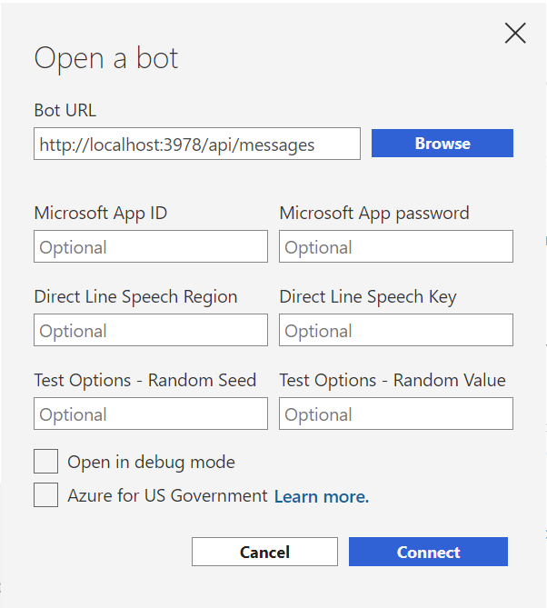
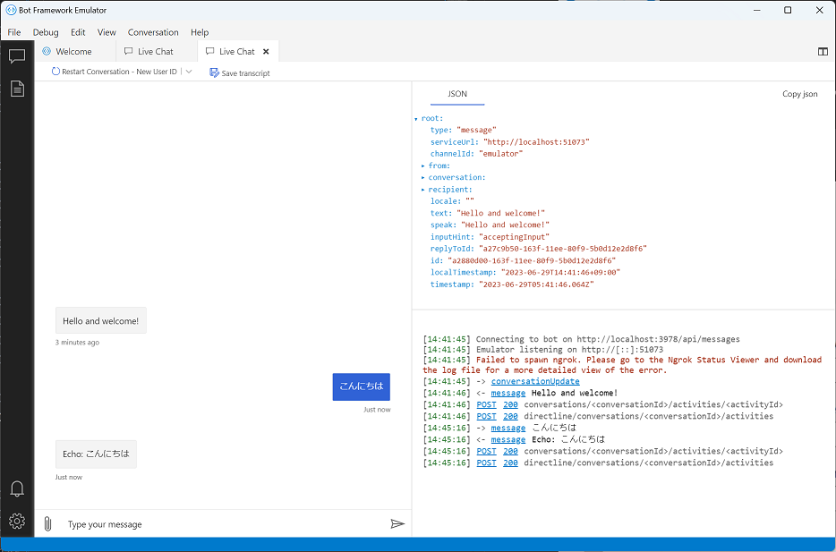
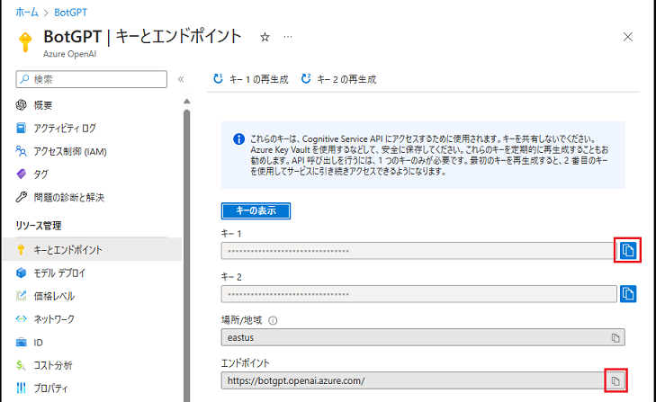
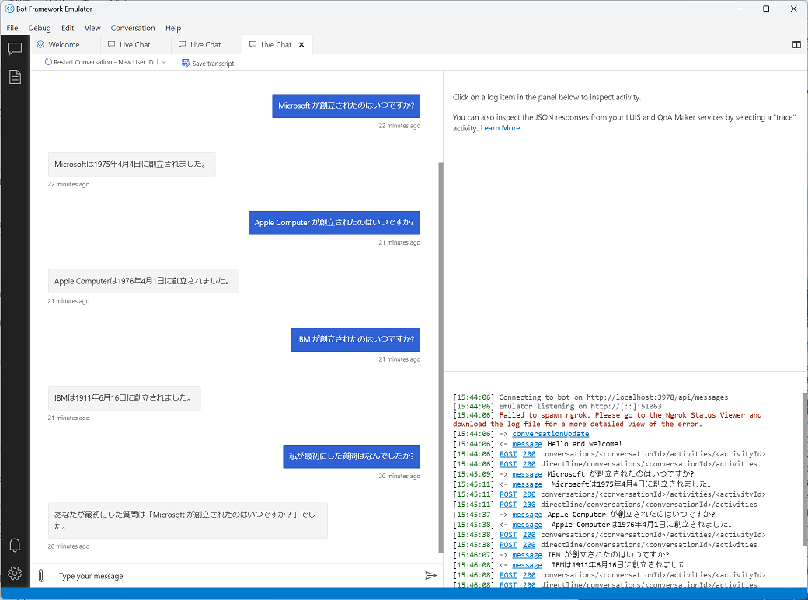

# Microsoft Bot Framework と Azure OpenAI チャット ボットの統合 

Microsoft Bot Frameworkと Azure Bot Service は、インテリジェント ボットの構築、テスト、デプロイ、管理を行うライブラリ、ツール、サービスのコレクションです。

Microsoft Bot Framework SDK は、[チャットボットの開発に必要な会話についての機能](https://learn.microsoft.com/ja-jp/azure/bot-service/bot-builder-basics?view=azure-bot-service-4.0)がすべて揃っているため、これを使用すると簡単にチャットボットを作成することができます。

 Azure Bot Service は Bot Framework SDK を使用して開発されたアプリケーションのエンドポイントをボットとしてホストするためのサービスです。Azure Bot Service は、ボットのホスト、デプロイ、管理、および接続を行うための機能を提供します。Azure Bot Service は、Azure Portal から簡単に作成することができます。

 Azure Bot Service が提供するチャネルや、各開発言語用の Bot Framework SDK 向けに個別にコミュニティ等から提供されるアダプターを使用して、チャットボットをさまざまなメッセージング プラットフォームや、Web サイト、モバイル アプリケーションなど提供することができます。

Bot Framework SDK v4 でサポートされているチャネルとアダプターの種類については以下のドキュメントをご参照ください。

- [**Bot Framework SDK v4 のチャネルとアダプター**](https://github.com/microsoft/botframework-sdk#channels-and-adapters)

この演習では演習 1 で作成したチャットボットを Bot Framework SDK で作成したボットに統合し、Azure Bot Service でホストします。

なお、この演習は、演習 1 のタスク 3 とは**別の方法でチャットボットをホストするもの**となります。Bot Framework SDK を使用したボットから Azure OpenAI チャットボットを呼び出す場合には、Azure OpenAI チャットボットを個別に App Service にデプロイしておく必要はありません。

<br>

## タスク 1 : Bot Framework SDK を使用した基本的なチャットボットの作成

このタスクでは、Bot Framework SDK を使用して基本的なチャットボットを作成します。

Bot Framework SDK v4 では C#、JavaScript、Python、Java、TypeScript などの言語を使用してチャットボットを作成することができます。この演習では、JavaScript を使用してチャットボットを作成します。

他の開発言語を使用する場合には、以下のドキュメントをご参照してください。

* [**Bot Framework SDK を使用してボットを作成する**](https://learn.microsoft.com/ja-jp/azure/bot-service/bot-service-quickstart-create-bot?view=azure-bot-service-4.0&tabs=csharp%2Cvs)


ただし、Python、Java SDK は、2023 年 11 月に終了する最終的な長期サポートで廃止されますので、今後は C#、JavaScript、TypeScript を使用してチャットボットを作成することをお勧めします。

参考 : [Bot Framework SDK の新機能](https://learn.microsoft.com/ja-jp/azure/bot-service/what-is-new?view=azure-bot-service-4.0)

### タスクの準備

この演習では、Visual Studio Code、Node.js ランタイムの他にいくつかの Node.js パッケージを使用します。

以下のコマンドを上から順に実行し、Node.js パッケージをインストールします。

```bash
npm install -g npm
npm install -g yo
npm install -g generator-botbuilder
```

その他、以下のコマンドを実行し Node.js のバージョンを確認します。

```bash
node -v
```
v17.x、v18.16.**0** では生成したプロジェクトが正常に動作しないことが確認されており、v18.16.**1** ではボットのプロジェクトは正しく動作しますが、タスク 2 で行う @azure/openai のインストールに失敗します。

よって上記の状況から **v16.20.0 のバージョン**を使用してください。


また、タスクの手順を実行する前に、かならず [**Bot Framework Emulator のインストール**](https://github.com/Microsoft/BotFramework-Emulator/releases/latest)を完了しておいてください。

<br>

### タスクの実施

botbuilder ジェネレーターを使用して、オウム返しボットのプロジェクトを生成します。

手順は以下の通りです。

\[手順\]

1. 任意のフォルダーをコマンドプロンプトで開きます

2. 以下のコマンドを実行します

    ```bash
    yo botbuilder
    ```
3. プロンプトが表示されるので、各プロンプトを以下のように入力します

    |プロンプト|入力値|
    |:--|:--|
    |? What's the name of your bot?|`任意の名前`|
    |? What will your bot do?|`既定のまま[Enter]キーを押下`|
    |? What programming language do you want to use?|`JavaScript`|
    |? Which template would you like to start with?|`Echo Bot`|
    |? Looking good. Shall I go ahead and create your new bot?|`Y`|

    プロジェクトの生成が完了するのを待ちます

4. コマンド プロンプトで `ls` コマンドを実行し、前の手順で指定したボットの名前が付いたフォルダーが生成されていることを確認します

    ```bash
    ls
    ```

    ```bash
    <BOT_NAME>
    ```
    続いて `cd` コマンドを使用して、生成されたプロジェクトのフォルダーに移動します

    ```bash
    cd <BOT_NAME>
    ```

5. 念のために、以下のコマンドを実行し、依存関係のあるモジュールをインストールします

    ```bash
    npm install
    ```
6. 以下のコマンドを実行し、ボットを起動します

    ```bash 
    npm start
    ```
    ボットが起動すると、以下のようなメッセージが表示されます

    ```bash
    restify listening to http://[::]:3978

    Get Bot Framework Emulator: https://aka.ms/botframework-emulator

    To talk to your bot, open the emulator select "Open Bot"
    ```
7. Bot Framework Emulator を起動します

    > [!NOTE]
    > Bot Framework Emulator は、Windows、macOS、Linux で使用することができます。
    
    もし起動方法が分からない場合には、お使いのコンピューターのデスクトップ、あるいはメニューで以下のアイコンを探し、マウスでダブルクリックしてください。

    

8. Bot Framework Emulator のメニュー \[**File**\] - \[**Open Bot**\]をクリックし、表示されたダイアログボックスの \[**Bot URL**\] に以下の URL を入力し、

    ```bash
    http://localhost:3978/api/messages
    ```

    

    \[**Connect**\] ボタンをクリックします

9. 接続が成功すると Bot Framework Emulator のチャット画面に "Hello and welcome!" と表示されます

    (※)初回接続時は、ボットが起動するまでに数秒かかることがあります。その場合には、しばらく待ってからもう一度 \[**Send**\] ボタンをクリックしてください。

10. チャット画面の下部にあるテキストボックスになにがしかのメッセージを入力し、\[**Send**\] ボタンをクリックします

    

    ボットから入力してた内容が返信されることを確認します


ここまでの手順で Bot Framework SDK を使用したボットのプロジェクトを生成し、ローカルで起動することができました。

次の演習では、このタスクで生成したプロジェクトのコードを編集し、演習 1) で作成した OpenAI ボットと統合します。

<br>

## タスク 2 : Bot Framework ボットと OpenAI ボットの統合

このタスクでは、タスク 1 で生成したボット プロジェクトのコードを編集し、OpenAI ボットと統合します。

### タスクの準備

コードを編集するまえに、演習 1) で作成した OpenAI ボットに接続するためのエンドポイントと API キー、デプロイメント名を取得します。

具体的な手順は以下の通りです。

\[手順\]

1. [Azure Portal](https://portal.azure.com/) にサインインし、ポータル画面の上部にある検索ボックスに演習 1) で作した Azure OpenAI サービス名を入力します

2. 検索結果から演習 1) で作成した Azure OpenAI サービスのインスタンスをクリックします

3. Azure OpenAI サービスのインスタンスの設定画面左のメニューブレードで \[**キーとエンドポイント**\] をクリックし、遷移した画面で \[**キー**\] と \[**エンドポイント**\]の値をコピーしてメモしておきます

    

4. 画面左のメニューブレードで\[**概要**\] メニューをクリックし、遷移した画面で \[**デプロイ**\] ボタンをクリックします

    

    Web ブラウザーで新しいタブが開き、Open AI Studio の画面の \[**デプロイ**\] 画面にデプロイ一覧が表示されるので、演習 1) で作成したデプロイ名を見つけてメモします

ここまでの作業で演習 1) で作成した OpenAI ボットに接続するための情報の取得作業は完了です。

次の手順では、タスク 1 で生成したボット プロジェクトのコードを編集し、OpenAI ボットと統合します。

なお、タスク 2 の作業に入る前に、以下のクイックスタートを実施することでより理解が深まります。

必須ではありませんが実施することを強くお勧めします。

- [**クイック スタート: Azure OpenAI Service で ChatGPT と GPT-4 の使用を開始する**](https://learn.microsoft.com/ja-jp/azure/cognitive-services/openai/chatgpt-quickstart?tabs=command-line&pivots=programming-language-javascript)

<br>

## Bot Framework SDK で作成したボット プロジェクトの編集

タスク 1 で生成したオウム返しボットのプロジェクトと、タスク 2 の準備で入手した OpenAI ボットへの接続情報を使用して、ボット プロジェクトのコードを編集します。

具体的な手順は以下の通りです。


\[手順\]

1. Visual Studio Code を起動し、タスク 1 で生成したボット プロジェクトのフォルダーを開きます

2. Visual Studio Code のメニュー \[**表示**\] - \[**ターミナル**\] をクリックし、表示されたターミナル画面で以下のコマンドを実行します

    ```bash
    npm install @azure/openai
    ```
3. Visual Studio Code のエクスプローラー画面で、**.env** ファイルを開き、以下のエントリーを追加します

    ```bash
    AZURE_OPENAI_ENDPOINT= %タスク2:準備で取得したエンドポイント%
    AZURE_OPENAI_KEY= %タスク2:準備で取得した API キー%
    DeploymentID= %タスク2:準備で取得したデプロイ名%
    ```

    キーボードの \[Ctrl\] + \[S\] キーを押下して追加した内容を保存します

4. Visual Studio Code のエクスプローラー画面で、**bot.js** ファイルを開き、以下のコードの下に

    ```javascript
    const { ActivityHandler, MessageFactory } = require('botbuilder');
    ```

    以下のコードを追加します

    ```javascript
    //追加するAzure Open AI Service 関連
    const { OpenAIClient, AzureKeyCredential } = require("@azure/openai");
    const endpoint = process.env["AZURE_OPENAI_ENDPOINT"];
    const azureApiKey = process.env["AZURE_OPENAI_KEY"];
    const deploymentId = process.env["DeploymentID"];
    const client = new OpenAIClient(endpoint, new AzureKeyCredential(azureApiKey));
    let messages = [
        { role: "system", content: "You are a helpful assistant." }
    ];
    ```
5. 同 **bot.js** ファイル中で、ユーザーからの問い合わせに対し応答を返す **this.onMessage** メソッドの内容を以下のように変更します

    ```javascript
    this.onMessage(async (context, next) => {
        const replyText = `Echo: ${ context.activity.text }`;

        //追加されたコード
        const message = { role: "user", content: context.activity.text };
        messages.push(message);
        const result = await client.getChatCompletions(deploymentId, messages,{"temperature": 0,"max_tokens": 100});
        let answerText='';
        for (const choice of result.choices) {
            console.log(choice.message);
            answerText = `${answerText}\n\n${choice.message.content}`;
            messages.push(choice.message);
        }
        
        //変更されたコード
        await context.sendActivity(MessageFactory.text(answerText, replyText));

        // By calling next() you ensure that the next BotHandler is run.
        await next();
    });
    ```
6. Visual Studio Code のメニュー \[**表示**\] - \[**ターミナル**\] をクリックし、表示されたターミナル画面で以下のコマンドを実行しボットのプロジェクトを開始します

    ```bash
    npm start
    ```

    ボットが起動すると、以下のようなメッセージが表示されます

    ```bash
    restify listening to http://[::]:3978

    Get Bot Framework Emulator: https://aka.ms/botframework-emulator

    To talk to your bot, open the emulator select "Open Bot"
    ```
7. ボットが起動したら、ボット フレームワーク エミュレーターを起動し、タスク 1 での手順を参考に **http://localhost:3978/api/messages** に接続します

8. ボット フレームワーク エミュレーターに接続したら、ボットになにがしかの質問を送信し、質問に対する回答が返ることを確認します

    

以上で、タスク 2 の作業は完了です。

次の演習 3) では今回 Bot Framework SDK で作成したボットを Azure Bot Service にデプロイし、Web チャットを使用してボットと対話する方法と他のメッセージングプラットフォームにボットとして登録する方法を学習します。

<br>

<hr>

👉 [**演習 3) Bot Framework ボットアプリケーションのデプロイ**](Ex03.md)


👈 [演習 2) Microsoft Bot Framework と Azure OpenAI チャット ボットの統合](Ex02.md)

🏚️ [README に戻る](README.md)