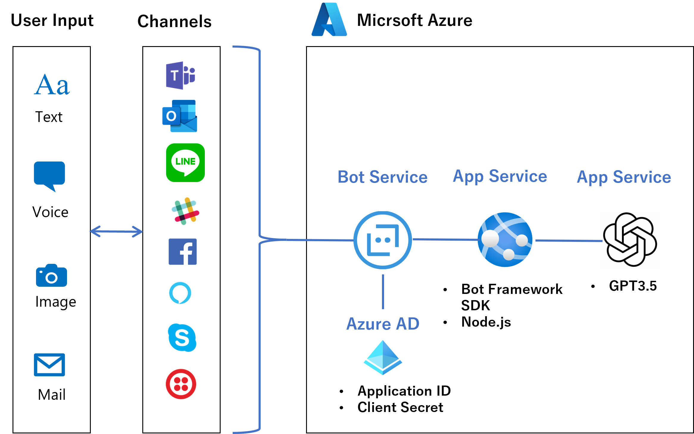

# Azure Open API Service GPT3 AI Bot 作成チュートリアル

## 概要

このチュートリアルは **Microsoft [Azure OpenAI Service](https://learn.microsoft.com/ja-jp/azure/cognitive-services/openai/overview)** に含まれるモデル GPT3.5 と **[Azure Bot Service](https://learn.microsoft.com/ja-jp/azure/bot-service/?view=azure-bot-service-4.0) ([Microsoft Bot Framework SDK](https://learn.microsoft.com/ja-jp/azure/bot-service/bot-service-overview?view=azure-bot-service-4.0))** を組み合わせて文章生成を行う Bot を作成する手順を説明するものです。

このチュートリアルでは、Azure での Open AI リソースの作成から Microsoft Bot Framework を使用したローカル環境でのチャットボットの作成、Azure Bot Service へのデプロイまでを行います。

このチュートリアルを完了すると、作成したチャットボットをさまざまなメッセージング プラットフォームに公開する準備が整います。

 

## 対象者

このチュートリアルは以下の知識がある方を対象としています。

* **Microsoft Azure の基本的な知識**

    Azure のリソースを作成、操作するための基本的な(MCP [AZ-900](https://learn.microsoft.com/ja-jp/certifications/exams/az-900/) 程度の)知識が必要です。

* **Visual Studio Code を使用したコーディング経験**

    このチュートリアルでは、Visual Studio Code を使用して Bot Framework ボットアプリケーションを作成します。Visual Studio Code でのコーディング経験が必要です。

## 要件

このチュートリアルを実施するには以下の環境が必要です。

- **[Microsoft Azure サブスクリプション](https://azure.microsoft.com/ja-jp/free/) と Azure Open AI サービスの[利用資格](https://aka.ms/oaiapply)**

    >【重要】現在、Azure Open AI の利用は Microsoft と既存のパートナーシップ関係があるお客様、リスクの低いユース ケース、軽減策の取り入れに取り組んでいるお客様に制限されており、**利用には申請が必要**です。申請については、以下の申請フォームに記載されています。 利用を開始するにはこちらからお申し込みください。

    - [**Azure OpenAI Service へのアクセス申請**](https://aka.ms/oaiapply)

- [**Visual Studio Code**](https://code.visualstudio.com/)

    Visual Studio Code から Azure のリソースを作成するための以下の拡張もインストールしてください。
    - [Azure Tools](https://marketplace.visualstudio.com/items?itemName=ms-vscode.vscode-node-azure-pack)

- [**Node.js**](https://nodejs.org/ja/)

    > 【重要】現状、Node.js のバージョンの 17 以降では、Bot Framework SDK が正常に動作しないため、[**Node.js のバージョンは 16 以前**](https://nodejs.org/download/release/v16.20.1/)を使用してください。
    > ローカル環境で Node.js のバージョンを任意で切り替えるには Windows では [**nvm-windows**](https://github.com/coreybutler/nvm-windows) 、Mac では [nvm](https://github.com/nvm-sh/nvm) を使用すると便利です。
    > 詳しくは以下のドキュメントを参照してください。

    - [**nvm-windows のインストール**](https://learn.microsoft.com/ja-jp/windows/dev-environment/javascript/nodejs-on-windows#install-nvm-windows-nodejs-and-npm)

    - [**nvm のインストール**](https://learn.microsoft.com/ja-jp/windows/dev-environment/javascript/nodejs-on-wsl#install-nvm-nodejs-and-npm)

- [**Bot Framework Emulator**](https://github.com/microsoft/BotFramework-Emulator)

 

## 演習

1. [**Azure Open AI リソースの作成**](Ex01.md)
    - [タスク 1 : Azure ポータルから Open AI リソースを作成する](Ex01.md#%E3%82%BF%E3%82%B9%E3%82%AF-1--azure-%E3%83%9D%E3%83%BC%E3%82%BF%E3%83%AB%E3%81%8B%E3%82%89-open-ai-%E3%83%AA%E3%82%BD%E3%83%BC%E3%82%B9%E3%82%92%E4%BD%9C%E6%88%90%E3%81%99%E3%82%8B)

    - [タスク 2 : Azure OpenAI Studio へのモデルのデプロイ](Ex01.md#%E3%82%BF%E3%82%B9%E3%82%AF-2--azure-openai-studio-%E3%81%B8%E3%81%AE%E3%83%A2%E3%83%87%E3%83%AB%E3%81%AE%E3%83%87%E3%83%97%E3%83%AD%E3%82%A4)

    - [タスク 3 : Azure OpenAI Studio で作成したチャットボットを Azure App Service にデプロイ](Ex01.md#%E3%82%BF%E3%82%B9%E3%82%AF-3---azure-openai-studio-%E3%81%A7%E4%BD%9C%E6%88%90%E3%81%97%E3%81%9F%E3%83%81%E3%83%A3%E3%83%83%E3%83%88%E3%83%9C%E3%83%83%E3%83%88%E3%82%92-azure-app-service-%E3%81%AB%E3%83%87%E3%83%97%E3%83%AD%E3%82%A4)

    - [オプション : 独自データの追加](Ex01.md#%E3%82%AA%E3%83%97%E3%82%B7%E3%83%A7%E3%83%B3--%E7%8B%AC%E8%87%AA%E3%83%87%E3%83%BC%E3%82%BF%E3%81%AE%E8%BF%BD%E5%8A%A0)

2. [**Microsoft Bot Framework と Azure OpenAI チャット ボットの統合**](Ex02.md)

    - [タスク 1 : Bot Framework SDK を使用した基本的なチャットボットの作成](Ex02.md#%E3%82%BF%E3%82%B9%E3%82%AF-1--bot-framework-sdk-%E3%82%92%E4%BD%BF%E7%94%A8%E3%81%97%E3%81%9F%E5%9F%BA%E6%9C%AC%E7%9A%84%E3%81%AA%E3%83%81%E3%83%A3%E3%83%83%E3%83%88%E3%83%9C%E3%83%83%E3%83%88%E3%81%AE%E4%BD%9C%E6%88%90)

    - [タスク 2 : Bot Framework ボットと OpenAI ボットの統合](Ex02.md#%E3%82%BF%E3%82%B9%E3%82%AF-2--bot-framework-%E3%83%9C%E3%83%83%E3%83%88%E3%81%A8-openai-%E3%83%9C%E3%83%83%E3%83%88%E3%81%AE%E7%B5%B1%E5%90%88)

    - [タスク 3 : Bot Framework SDK で作成したボット プロジェクトの編集](Ex02.md#%E3%82%BF%E3%82%B9%E3%82%AF-3--bot-framework-sdk-%E3%81%A7%E4%BD%9C%E6%88%90%E3%81%97%E3%81%9F%E3%83%9C%E3%83%83%E3%83%88-%E3%83%97%E3%83%AD%E3%82%B8%E3%82%A7%E3%82%AF%E3%83%88%E3%81%AE%E7%B7%A8%E9%9B%86)

3. [**Bot Framework ボットアプリケーションのデプロイ**](Ex03.md)

    - [タスク 1 : Bot Service の作成](Ex03.md#%E3%82%BF%E3%82%B9%E3%82%AF-1--bot-service-%E3%81%AE%E4%BD%9C%E6%88%90)

    - [タスク 2 : ボット アプリケーションへの ID 設定と Azure App Service へのデプロイ](Ex03.md#%E3%82%BF%E3%82%B9%E3%82%AF-2--%E3%83%9C%E3%83%83%E3%83%88-%E3%82%A2%E3%83%97%E3%83%AA%E3%82%B1%E3%83%BC%E3%82%B7%E3%83%A7%E3%83%B3%E3%81%B8%E3%81%AE-id-%E8%A8%AD%E5%AE%9A%E3%81%A8-azure-app-service-%E3%81%B8%E3%81%AE%E3%83%87%E3%83%97%E3%83%AD%E3%82%A4)

    - [タスク 3. Azure Bot に Bot Framework ボットアプリケーションを登録する](Ex03.md#%E3%82%BF%E3%82%B9%E3%82%AF-3-azure-bot-%E3%81%AB-bot-framework-%E3%83%9C%E3%83%83%E3%83%88%E3%82%A2%E3%83%97%E3%83%AA%E3%82%B1%E3%83%BC%E3%82%B7%E3%83%A7%E3%83%B3%E3%82%92%E7%99%BB%E9%8C%B2%E3%81%99%E3%82%8B)

    - [さまざまなメッセージング プラットフォームにボットを公開する方法について](Ex03.md#%E3%81%95%E3%81%BE%E3%81%96%E3%81%BE%E3%81%AA%E3%83%A1%E3%83%83%E3%82%BB%E3%83%BC%E3%82%B8%E3%83%B3%E3%82%B0-%E3%83%97%E3%83%A9%E3%83%83%E3%83%88%E3%83%95%E3%82%A9%E3%83%BC%E3%83%A0%E3%81%AB%E3%83%9C%E3%83%83%E3%83%88%E3%82%92%E5%85%AC%E9%96%8B%E3%81%99%E3%82%8B%E6%96%B9%E6%B3%95%E3%81%AB%E3%81%A4%E3%81%84%E3%81%A6)

 

---
## LICENSE

このドキュメントに記載されている情報 (URL や他のインターネット Web サイト参照を含む) は、将来予告なしに変更することがあります。別途記載されていない場合、このソフトウェアおよび関連するドキュメントで使用している会社、組織、製品、ドメイン名、電子メール アドレス、ロゴ、人物、場所、出来事などの名称は架空のものです。実在する商品名、団体名、個人名などとは一切関係ありません。お客様ご自身の責任において、適用されるすべての著作権関連法規に従ったご使用をお願いいたします。著作権法による制限に関係なく、マイクロソフトの書面による許可なしに、このドキュメントの一部または全部を複製したり、検索システムに保存または登録したり、別の形式に変換したりすることは、手段、目的を問わず禁じられています。ここでいう手段とは、複写や記録など、電子的、または物理的なすべての手段を含みます。

マイクロソフトは、このドキュメントに記載されている内容に関し、特許、特許申請、商標、著作権、またはその他の無体財産権を有する場合があります。別途マイクロソフトのライセンス契約上に明示の規定のない限り、このドキュメントはこれらの特許、商標、著作権、またはその他の知的財産権に関する権利をお客様に許諾するものではありません。

製造元名、製品名、URL は、情報提供のみを目的としており、これらの製造元またはマイクロソフトのテクノロジを搭載した製品の使用について、マイクロソフトは、明示的、黙示的、または法令によるいかなる表明も保証もいたしません。製造元または製品に対する言及は、マイクロソフトが当該製造元または製品を推奨していることを示唆するものではありません。掲載されているリンクは、外部サイトへのものである場合があります。これらのサイトはマイクロソフトの管理下にあるものではなく、リンク先のサイトのコンテンツ、リンク先のサイトに含まれているリンク、または当該サイトの変更や更新について、マイクロソフトは一切責任を負いません。リンク先のサイトから受信した Web キャストまたはその他の形式での通信について、マイクロソフトは責任を負いません。マイクロソフトは受講者の便宜を図る目的でのみ、これらのリンクを提供します。また、リンクの掲載は、マイクロソフトが当該サイトまたは当該サイトに掲載されている製品を推奨していることを示唆するものではありません。

Copyright (c) Microsoft Corporation. All rights reserved.

